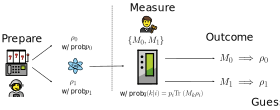

<h1>Semidefinite programming for Quantum Information</h1>

### ⚙️ Configuring the notebook

**⚠️ Run the CSS cell below in order to properly format the notebook**


```python
%%html
<!-- Colors: https://encycolorpedia.com/-->
<!-- Comments ommited due to a bug in Jupyter-->

<style>

    h1 { 
        font-size: 30px; 
        color: rgba(220, 20, 60, 1) !important;  
    }

    h2 {
     font-size: 25px;
     color: rgba(255, 140, 0, 1); /* Orange */		 
    }	 

    h3 {
     font-size: 20px;
     color:rgba(204, 85, 0, 1); /* Dark orange */		 
    }	 
        
    td {
      text-align: center;
    }

    div.highlight_red {    
        background-color: rgba(179, 0, 0, .1);
        background-opacity : 0.5;
        }

    div.highlight_red .title_box {
        background-color: rgba(179, 0, 0, .6);
        width: 100%;
    }

    div.highlight_green {    
        background-color: rgba(	19, 98, 7, .1);
        background-opacity : 0.5;
        }

    div.highlight_green .title_box {
        background-color: rgba(	19, 130, 7, .6);
        width: 100%;
    }

    div.highlight_turquoise {    
        background-color: rgba(	40, 154, 164, .1);
        background-opacity : 0.5;
        }

    div.highlight_turquoise .title_box {
        background-color: rgba(	40, 154, 164, .6);
        width: 100%;
    }

    div.highlight_purple {    
        background-color: rgba(120, 81, 169, .1);
        background-opacity : 0.5;
        }

    div.highlight_purple .title_box {
        background-color: rgba(120, 81, 169, .6);
        width: 100%;
    }

    div.highlight_blue {    
        background-color: rgba(	65, 105, 225, .1);
        background-opacity : 0.5;
    }

    div.highlight_blue .title_box {
        background-color: rgba(	65, 105, 225, .6);
        width: 100%;
    }

    .title{
        text-indent: 1%;
        padding: .25em;
        font-weight: bold;
        font-size: 18px;
        color : white;
    }

    .content{
        text-indent: 2%;
        padding: 1em;
        font-size: 14px;
    }

</style>
```


<!-- Colors: https://encycolorpedia.com/-->
<!-- Comments ommited due to a bug in Jupyter-->

<style>

    h1 { 
        font-size: 30px; 
        color: rgba(220, 20, 60, 1) !important;  
    }

    h2 {
     font-size: 25px;
     color: rgba(255, 140, 0, 1); /* Orange */		 
    }	 

    h3 {
     font-size: 20px;
     color:rgba(204, 85, 0, 1); /* Dark orange */		 
    }	 

    td {
      text-align: center;
    }

    div.highlight_red {    
        background-color: rgba(179, 0, 0, .1);
        background-opacity : 0.5;
        }

    div.highlight_red .title_box {
        background-color: rgba(179, 0, 0, .6);
        width: 100%;
    }

    div.highlight_green {    
        background-color: rgba(	19, 98, 7, .1);
        background-opacity : 0.5;
        }

    div.highlight_green .title_box {
        background-color: rgba(	19, 130, 7, .6);
        width: 100%;
    }

    div.highlight_turquoise {    
        background-color: rgba(	40, 154, 164, .1);
        background-opacity : 0.5;
        }

    div.highlight_turquoise .title_box {
        background-color: rgba(	40, 154, 164, .6);
        width: 100%;
    }

    div.highlight_purple {    
        background-color: rgba(120, 81, 169, .1);
        background-opacity : 0.5;
        }

    div.highlight_purple .title_box {
        background-color: rgba(120, 81, 169, .6);
        width: 100%;
    }

    div.highlight_blue {    
        background-color: rgba(	65, 105, 225, .1);
        background-opacity : 0.5;
    }

    div.highlight_blue .title_box {
        background-color: rgba(	65, 105, 225, .6);
        width: 100%;
    }

    .title{
        text-indent: 1%;
        padding: .25em;
        font-weight: bold;
        font-size: 18px;
        color : white;
    }

    .content{
        text-indent: 2%;
        padding: 1em;
        font-size: 14px;
    }

</style>


<div class="highlight_red">
<div class="title_box">
    <div class="title">
        ⚠ Note
    </div>
</div>

<div class="content">
    To properly run this notebook we will need to install the <a href="https://www.cvxpy.org">cvxpy library</a> and a few other optional dependencies. Also be sure to install jupyter-lab/jupyter notebook in case you do not have it. Note that some packages might also require a slightly older version of other applications.
</div>
</div>

For convenience, we first create an anaconda environment ```sdp_env```:

```
conda create -n sdp_env
conda activate sdp_env
```

Where we install the packages:

```
conda install -c conda-forge cvxpy matplotlib
```

If you already have a jupyter-lab/notebook installation it is then helpful to run the python Kernel <a href="">inside this environment</a>. You can then choose ```sdp_env_kernel``` among the Python3 Kernels in Jupyter-lab.

```
conda install ipykernel
ipython kernel install --user --name=sdp_env_kernel
```

Finally, if you want to run the final examples it is also necessary to install [qutip](https://qutip.org/docs/latest/installation.html) for a few quantum imformation operations. Note that this might also require you to [downgrade scipy](https://stackoverflow.com/questions/76560698/python-3-10-qutip-attributeerror-cant-set-attribute-format) as of Jan. 2024.

```
conda install -c conda-forge qutip scipy==1.10.1    
```

If you plan on using [quspin](https://quspin.github.io/QuSpin/) instead for many-body calculations it might also be necessary to downgrade to Python 3.10 in order to keep everything compatible.


```python
# PACKAGES
from IPython.display import HTML
import cvxpy as cp
import numpy as np
import matplotlib.pyplot as plt
import matplotlib.colors
import matplotlib.cm as cm

# NUMPY CONFIGURATION
np.set_printoptions(formatter={'float': lambda x: "{0:0.2f}".format(x)})

# OPTIONAL MATPLOTLIB CONFIGURATION
# LaTeX packages. Comment if LaTeX is unavailable
plt.rc('text.latex', preamble=r'\usepackage{amsmath}')

# LaTeX fonts
plt.rcParams.update({
    "text.usetex": True,
    "font.family": "Helvetica"
})

# Changes default size for label and title
plt.rcParams['axes.labelsize'] = 22
plt.rcParams['axes.titlesize'] = 24

# Size for ticks and legends
plt.rcParams['xtick.labelsize'] = 22
plt.rcParams['ytick.labelsize'] = 22
plt.rcParams['legend.fontsize'] = 18
plt.rcParams['legend.title_fontsize'] = 20

matplotlib.rcParams['axes.linewidth'] = 1.0
```

## Introduction 

### Definitions

A very natural type of mathematical problem arises when one tries to optimize a quantity under a set of constraints for the underlying variables. This is ubiquitous in many fields, and as we will see, also fits like a glove for many problems in quantum information science. More specifically, the ingredients we have are:

 - A _linear_ objective function $\bf{c} \cdot \bf{x}$ which we want to either maximize or minimize. Here ${\bf{x}} = (x_1, ..., x_n)$ corresponds to the _variables_ of the problem, which we want to solve for. We will use the very clever notation from [1] and normally depict <span style="color:orange">the variables in  orange</span>. Similarly, ${\bf{c}} = (c_1, ..., c_n)$ is just a vector of constants which set the objective function.
 - A matrix $\bf{A}$ and a vector $\bf{b}$ which set the inequalities/constraints
 - A positiveness condition for the variables

<div class="highlight_blue">
<div class="title_box">
    <div class="title">
        ☞ Linear Problem
    </div>
</div>
<div class="content">
In its so called standard form, the LP is a <b>convex</b> problem which can be cast into the following form:

$$
\begin{split}
    & \mathrm{Maximize \quad}     & & \bf{c} \cdot \bf{\color{orange}{x}} \\
    & \mathrm{subject \ to \quad} & & \bf{A} \cdot \bf{\color{orange}{x}} \leq \bf{b}\\
                                & & & \bf{\color{orange}{x}} \geq 0
\end{split}
$$
</div>
</div>

Intuitively, the constraints above define a [polytope](!https://en.wikipedia.org/wiki/Convex_polytope). In other words, all the allowed $\bf{x}$ respecting these constraints live inside this convex $n$-dimensional euclidean object. In simple terms, think of a convex convex polygon in 2 dimensions and a convex polyhedron in 3 dimensions. 

<center></center>

What we want to do in this problem is thus find the point within this set which optimizes the objective function. Surprisingly, there is a very geometrical solution to this algebraic problem. To see how this happens, we can begin with a very silly example. Consider the following linear problem:

$$
\begin{array}{rl}
{\displaystyle\max} & 3{\color{orange} x_1}+4{\color{orange} x_2}  \\
\text{subject to} & 0 \leq {\color{orange} x_1} \leq 5\\
& 0 \leq {\color{orange} x_2} \leq 4\\
& \frac{1}{2}{\color{orange} x_1} + {\color{orange} x_2} \leq 5\\
& 2{\color{orange} x_1} + {\color{orange} x_2} \leq 11\\
\end{array}
$$

Here we have just two variables, given by ${\color{orange} x_1}$ and ${\color{orange} x_2}$, so everything lies on the cartesian plane. The **objective function** here is $3{\color{orange} x_1}+4{\color{orange} x_2}$, which is the quantity we wish to maximize. So, how would one go about solving this problem?

The first thing which would be nice to see, is why excatly we get this type of convex shape mentioned before. These arise due to the **constraints** of the problem. Everytime we add a new inequality we are cutting the $n$-dimensional space with a hyperplane which further restricts the region of feasible points. In the figure below we illustrate how the polygon corresponding to the feasible set of the problem above can be constructed. The first two inequalities basically define a rectangle in the cartesian plane (left). Afterwards, if we introduce the last two equalities we will obtain two lines cutting through this rectangle, trimming some of its edges and further restricting the feasible set (center). When all these inequalities are considered we obtain the region shown on the rightmost panel. Our objective is to find the pair $(x_1, x_2)$ **within** this orange region which maximizes the objective function.

<div style="display: flex; flex-direction: row;">
    
    
    
</div>

Now the trick is to notice that the objective function, which is of the form $\bf{c} \cdot \bf{x}$, defines a family of hyperplanes if we write it as $\bf{c} \cdot \bf{x} = \alpha$, where $\alpha$ is a scalar. In our example, we have ${\bf c} = (3, 4)$, thus we have have a family of lines satisfying $3x_1+4x_2 = \alpha$. Our objective is simply to find the line which maximizes this expression, i.e. the objective function. The animation below illustrates this idea geometrically, showing the different lines as we increase the free parameter $\alpha$ and how they cross the feasible region:


```python
%%HTML

<center>
<video alt="test" controls>
    <source src="images/lp_gif.mp4" type="video/mp4">
</video>
</center>
```


<center>
<video alt="test" controls>
    <source src="images/lp_gif.mp4" type="video/mp4">
</video>
</center>


This is very helpful in bringing home some intuition, however this picture in itself does not seem completely systematic. If we are interested in a more algorithmic approach we can resort to what is likely the most famous algorithm for linear programming, the [simplex algorithm](https://en.wikipedia.org/wiki/Simplex_algorithm). This is a greedy algorithm which, in analogy to the figure shown above, "explores" the edges and vertices of a polytope in the "direction" of the objective function, eventually finding the vertex which maximizes the objetive function.

<center></center>

We omit much of the details here, but trick for solving this problem is using something called <span style="color:green;">slack variables</span>. These are "surplus" variables which allows to reexpress the inequalities for the variables ${\color{orange} \bf{x}}$ as _equalities_. The trade-off is that now we have a larger number of constraints and variables to keep track of. In our current example, we could reexpress the problem as:

$$
\begin{array}{rl}
{\displaystyle\max} & 3{\color{orange} x_1}+4{\color{orange} x_2}  \\
\text{subject to} & {\color{orange} x_1}                 & = 5 - {\color{green} s_1}  \\
& {\color{orange} x_2}                                   & = 4 - {\color{green} s_2}\\
& \frac{1}{2}{\color{orange} x_1} + {\color{orange} x_2} & = 5 - {\color{green} s_3}\\
& 2{\color{orange} x_1} + {\color{orange} x_2}           & = 11 - {\color{green} s_4}\\
& {\color{orange} x_1}, {\color{orange} x_2}, {\color{green} s_1}, {\color{green} s_2}, {\color{green} s_3}, {\color{green} s_4} \geq 0
\end{array}.
$$

Here we have introduced ${\color{green} s_1, \dots, s_4}$ as the <span style="color:green;">slack variables</span>. Note that as long as the slack variables are positive, the former constraints are also respected. This is useful because the equalities are now much more convenient to manipulate. The algorithm uses some pivoting rules, in the same spirit of the proccess of Gaussian elimination, to maximize the objetive function. While we omit the details here, implementations for this algorithm can be readily found in any reference. For instance, this <a href="https://en.wikipedia.org/wiki/Simplex_algorithm#:~:text=solution.%5B17%5D-,Simplex%20tableau,-%5Bedit%5D">Wikipedia page</a> shows how one can write down the so called _simples tableau_ to solve this problem. 

- Finally, [this YouTube video](https://www.youtube.com/watch?v=E72DWgKP_1Y) by _Tom S_ is probably one of the best resources to figure out how this works. It is a very pedagogical introduction with some great visuals to top it off.

### Basic Code Examples

Now, we refer back to our previous example. We will see how the library ```cvxpy``` can easily be used to tackle linear programming problems. The code snippet below shows the basic implematation of an objective function and the constraints. 

#### ⦿ Example 1 | Basic linear program


```python
# Variables
x1 = cp.Variable()
x2 = cp.Variable()

# Objective function
objective = cp.Maximize(4*x1 + 3*x2)

# Constraints
constraints = [x1>=0, x1<=5
               , x2>=0, x2<=4
               , x2 <= 5 - x1/2
               , x2 <= 11 - 2*x1]

# Solution
prob = cp.Problem(objective, constraints)
```

This yields:


```python
result = prob.solve()
print('RESULT:\n\nmax 4 * x1 + 3 * x2 = %0.2f, with x1 = %0.2f and x2 = %0.2f' % (result, x1.value, x2.value))
```

    RESULT:
    
    max 4 * x1 + 3 * x2 = 25.00, with x1 = 4.00 and x2 = 3.00


```python
print(prob)
```

    maximize 4.0 @ var71 + 3.0 @ var72
    subject to 0.0 <= var71
               var71 <= 5.0
               0.0 <= var72
               var72 <= 4.0
               var72 <= 5.0 + -var71 / 2.0
               var72 <= 11.0 + -2.0 @ var71


```python
print(prob.status)
```

    optimal


#### ⦿ Example 2 | Correlation Matrix

Consider the correlation matrix given by [4]:

$$
\gamma :=
\begin{pmatrix}
  1 & {\color{orange}x_{12}} & x_{13} \\
  {\color{orange}x_{12}} & 1 & {\color{orange}x_{23}} \\
  x_{13} & {\color{orange}x_{23}} & 1
\end{pmatrix}.
$$

Our objective in this example is to either maximize or minimize one of these entries, such as e.g. $x_{13}$, while respecting the semipositive definiteness of $\gamma$ and any further constraints which might be place upon the other entries. For instance, consider the problem:

$$
\begin{array}{rl}
{\displaystyle\min/\max} & x_{13} \\
\text{subject to} & -0.2 \leq {\color{orange}x_{12}} \leq -0.1\\
& 0.4 \leq {\color{orange}x_{23}} \leq 0.5\\
& \gamma \geq 0
\end{array}
$$

We can implement this with ```cvxpy``` as follows:


```python
# Symm. correlation matrix and its entries. We must make it symmetric, see: https://stackoverflow.com/questions/56414270/implement-lmi-constraint-with-cvxpy
n = 3
corr_mat = cp.Variable((n,n), symmetric=True)
x12 = corr_mat[0, 1]
x13 = corr_mat[0, 2]
x23 = corr_mat[1, 2]

# Objective and constraints
objective_max, objective_min = cp.Maximize(x13), cp.Minimize(x13)

constraints = [corr_mat >> 0]                          # Semi-positive definiteness
constraints += [corr_mat[i, i] == 1 for i in range(n)] # Diagonal
constraints += [ x12 <= -0.1                           # Correlations
               , x12 >= -0.2
               , x23 >= 0.4
               , x23 <= 0.5
              ]

# Solution
prob_max, prob_min = cp.Problem(objective_max, constraints), cp.Problem(objective_min, constraints)
```

This yields:


```python
# The optimal objective value is returned by `prob.solve()`.
result_max, result_min = prob_max.solve(), prob_min.solve()
print('RESULTS\nmax x_{13}: ', result_min, '\nmin x_{13}: ', result_max)
```

    RESULTS
    max x_{13}:  -0.9779989594128443 
    min x_{13}:  0.8719220302944627


<div class="highlight_green">
<div class="title_box">
    <div class="title">
        ❐ Remarks
    </div>
</div>


<div class="content">
<ul>
<li>Variables should be treated as objects of the type <code>cp.Variable()</code>. These can be multi-dimensional. Symmetries and other properties are encoded here as attributes. Note how we had to set the correlation matrix above as a cvxpy variable with the attribute <code>symmetric=True</code>. A general list of attributes and other advanced features can be found <a href=https://www.cvxpy.org/tutorial/advanced/index.html#attributes>here.</a></li>
    
<li>Objective functions and constraints are constructed on top of these variables. Constraints should be fed to the problem as a list of (in)equalities.</li>

<li> A first introduction on the functionalities of the library can be found <a href=https://www.cvxpy.org/tutorial/intro/index.html>here.</a></li>
</ul>
</div>
</div>

### Semidefinite Programming

In analogy to the basic linear program from the first section, we can also define the following type of problem:

<div class="highlight_blue">
<div class="title_box">
    <div class="title">
        ☞ SDP
    </div>
</div>
<div class="content">
In its so called standard form, it is a <b>convex</b> problem which can be cast into the following form:

$$
\begin{split}
    & \mathrm{Maximize \quad}     & & \mathrm{tr}{({\bf C} \bf{\color{orange}{X}})} \\
    & \mathrm{subject \ to \quad} & & \langle {\bf A}_i, {\bf{\color{orange}{X}}} \rangle \leq {\bf b}_i, \quad i=1,\dots,m\\
                                & & & \bf{\color{orange}{X}} \geq 0
\end{split}
$$
</div>
</div>

As we will see, this type of formulation is also ubiquitous and very useful for many problems in quantum information. In this new formulation, the <span style="color:orange;">variables</span> are now **operators**. In the linear program we required that the variables lie on the positive quadrant. What happens here instead is that with the constraint $\bf{\color{orange}{X}} \geq 0$ we are forcing the variables to live in a <a href="https://inst.eecs.berkeley.edu/~ee127/sp21/livebook/def_sdp.html">semidefinite cone</a>, or equivalently, that its eigenvalues are positive. Besides, we make two remarks:

- $\langle \bf{A}, \bf{B} \rangle$ should be understood as the Hilbert-Schmidt/Frobenius inner product $\langle \bf{A}, \bf{B} \rangle := \mathrm{tr}{(\bf{A}^\dagger \bf{B})}$
    
- Inequalities such as ${\bf A} \geq 0$ should be understood as positive semidefiniteness

### The Dual Problem

The form we saw above, both for the linear and for the SDP problem are the so called _primal_ forms. One can define a corresponding _minimization_ problem which has slightly different constraints and sets an _upper bound_ to the solution of the primal problem. We call this the <a href="https://en.wikipedia.org/wiki/Dual_linear_program#cite_note-gm06-1">dual</a> problem. However, for most of the easier applications we actually have a property called _strong duality_, which states that these two solutions actually _coincide_.

<div class="highlight_blue">
<div class="title_box">
    <div class="title">
        ☞ The Dual SPD
    </div>
</div>
<div class="content">
The dual problem can be cast in the following form:

$$
\begin{split}
    & \mathrm{Minimize \quad}     & & \sum_{i=1}^m {\bf b}_i \bf{\color{red}{y}_i} \\
    & \mathrm{subject \ to \quad} & & \sum_{i=1}^m {\bf A}_i \bf{\color{red}{y}_i} \geq {\bf C} \\
\end{split}
$$
</div>
</div>


Note how the number of <span style="color:red;">dual variables</span> corresponds to the number $m$ of constraints in the primal problem. Surprinsigly, what this generally means is that the dimensionality of these two problems will be different. Normally one derives the dual by using Lagrange multipliers [12-14].

#### ⦿ Example 3 | Eigenvalue computation

Computing the maximum (or minimum) eigenvalue of a Hermitian matrix ${\bf M}$ is a task which provides a very simple example of how we can set a primal problem and its dual. 
This actually comes from the notion of <a href="https://en.wikipedia.org/wiki/Rayleigh_quotient">Raylegh coefficients</a>.
More concretely, the primal problem for the _maximum_ eigenvalue can be cast in the form:

$$
\begin{split}
    & \mathrm{Maximize \quad}     & & \mathrm{tr}{({\bf M} \bf{\color{orange}{X}})} \\
    & \mathrm{subject \ to \quad} & & \langle {\bf I}, {\bf{\color{orange}{X}}} \rangle = 1\\
                                & & & \bf{\color{orange}{X}} \geq 0
\end{split}
$$


```python
# Variables
n = 3

# Flag complex true!
X = cp.Variable((n,n), complex=True)
M = np.random.randn(n, n) + 1j*np.random.randn(n, n)
M = (M+M.T.conjugate())/2

# Objective function
objective = cp.Maximize(cp.trace(cp.real(M @ X)))

# Constraints
constraints = [cp.trace(X) == 1, X >> 0]

# Solution
prob = cp.Problem(objective, constraints)
prob.solve()

print("PRIMAL: The max. eigenvalue value is %0.2f" % prob.value)
```

    PRIMAL: The max. eigenvalue value is 2.24


The dual problem is given by,

$$
\begin{split}
    & \mathrm{Minimize \quad}     & & {\color{red} y}\\
    & \mathrm{subject \ to \quad} & & {\color{red} y} {\bf I} - {\bf M} \geq 0 \\
\end{split}
$$


```python
# Variables
y = cp.Variable()

# Objective function
objective_dual = cp.Minimize(y)

# Constraints
constraints_dual = [y*np.eye(n) - M >> 0]

# Solution
prob_dual = cp.Problem(objective_dual, constraints_dual)
prob_dual.solve()

print("DUAL: The max. eigenvalue value is %0.2f" % prob_dual.value)
```

    DUAL: The max. eigenvalue value is 2.24


As a sanity check:


```python
print("np.eigval(M) = %0.2f" % np.max(np.linalg.eig(M)[0]).real)
```

    np.eigval(M) = 2.24


As a side note, also notice how the constraint $\langle {\bf I}, {\bf{\color{orange}{X}}} \rangle = 1$ corresponds to $\mathrm{Tr\ } \bf{\color{orange}{X}} = 1$, so this problem is analogous to the problem of finding the GS of a Hamiltonian!

<div class="highlight_red">
<div class="title_box">
    <div class="title">
        ⚠ Note
    </div>
</div>

<div class="content">

- When dealing with complex-valued operators, it is often necessary to flag the <code>cvxpy</code> variables as <code>cp.Variable(..., complex=True)</code>, otherwise we get unfeasible or outright wrong solutions

- Similarly, sometimes it is also necessary to tell <code>cvxpy</code> beforehand that a given expression is real with <code>cp.real(...)</code>
</div>
</div>

## Basic uses in quantum information 

### Quantum State Discrimination

We show in this example how these SDP methods fit like a glove for the problem of quantum state descrimination (QSD). The basic setup for a simplified version of QSD works as follows:

<div class="highlight_blue">
<div class="title_box">
    <div class="title">
        ☞ Two-state QSD
    </div>
</div>
<div class="content">

Consider a game with two players, Alice and Bob. 

<ul>
    <li>Alice prepares a (possibly mixed) quantum state $\rho_i$ with probability $p_i$, with $i = 0, 1$. </li>
    <li>Both Alice and Bob agree on the set of states $\{\rho_0, \rho_1\}$, as well as the corresponding probabilities, <b>beforehand</b>. This guarantees that there is no classical ignorance regarding the protocol.</li>
    <center></center>
    <li>Bobs receive an unkown state from the set $\{\rho_0, \rho_1\}$. His task is to perform a measurement on the incoming state, devising an optimal strategy to correctly guess it.</li>
    <li>Bob constructs a set of two POVMs $\{M_0, M_1\}$ which will help him guess the incoming state. Bob then associates a POVM $M_k$ with a given state $\rho_k$. That is, if Bob measures $M_k$ then he decides that the state sent by Alice is $\rho_k$.</li>
    <li>These POVMs are constructed in a way such that the probability of correctly guessing the state is maximized.</li>
    <center></center>
</ul>
</div>
</div>

Now, a few things come into play here. Unless the states $\rho_i$ are orthogonal, there is no protocol which will allow us to determine the incoming state free of errors due to the intrinsic quantum probabilities. For that reason, one should first choose a figure of merit which evaluates how good a given strategy is. In our example we specifically chose that to be the probability of correctly guessing the incoming state. Once that is decided, it is necessary to properly define the protocol, i.e. choose the POVMs.

Unfortunately, this problem is, in general, very hard to solve analytically. One of the few exceptions is precisely when one has to discriminate between only two states. For $n \geq 3$ things get much more complicated. Finally, also note that these states need not to be qubits. One can have larger dimensionality, such as qutrits.

Now, let us look at the possible outcomes of this experiment. Note that the chance of performing a particular measurement $M_k$ can be written as a _conditional_ probability, due to the fact the outcome distribution actually depends on the (unknown) state we are measuring in the first place. In other words, we can write something like

$$
\mathrm{Prob.\ of\ measuring\ }M_k\mathrm{\ given\ }\rho_i=
\mathrm{Prob.\ that\ }\rho_i\mathrm{\ was\ prepared\ }
\times
\mathrm{\ Prob.\ that\ }\rho_i\mathrm{\ yields\ }M_k
$$
or, 
$$
q(k | i) = p_i \mathrm{Tr\ } (M_k \rho_i)
$$

The probability of guessing _right_ occurs when $k = i$, that is, when the measured POVM $M_i$ correspods to the state $\rho_i$ received by Bob. In other words:

$$
p_{\mathrm{right}} = \sum_i q(k = i| i) = q(k = 0|0) + q(k = 1 |1) = p_0 \mathrm{Tr\ } (M_0 \rho_0) + p_1 \mathrm{Tr\ } (M_1 \rho_1).
$$

Similarly, the chances of making the _incorrect_ guess is:

$$
p_{\mathrm{wrong}} = \sum_i q(k \neq i| i) = q(k = 1|0) + q(k = 0 |1) = p_0 \mathrm{Tr\ } (M_1 \rho_0) + p_1 \mathrm{Tr\ } (M_0 \rho_1) = 1 - p_{\mathrm{right}}.
$$

What is very nice is that, due to the semipositive structure of the POVMs, this problem can thus be written as a SDP if we decide to maximize $p_{\mathrm{right}}$: 

$$
\begin{split}
    & \mathrm{Maximize \quad}     & & \sum_i  p_i \mathrm{Tr\ } ({\color{orange} M_i}\rho_i) =: p_{\mathrm{right}}\\
    & \mathrm{subject \ to \quad} & & \sum_i  \mathrm{Tr\ } {\color{orange} M_i} = 1\\
                                & & & {\color{orange} M_i} \geq 0 \quad \forall i.
\end{split}
$$

Here it is clear that the preparation probabilities $q_i$ and the corresponding states $\rho_i$ are given. Our task is to find the optimal set of POVMs and the associated probability $p_{\mathrm{right}}$.

#### ⦿ Example 4 | Numerical example of QSD

For a concrete numerical example, let us consider $p_0 = 0.4$ and $p_1 = 1 - p_0 = 0.6$, with states $\rho_0 = |0\rangle \langle0|$ and $\rho_1 = |+\rangle \langle+|$.


```python
# INPUTS
# Probabilities
p_0 = 0.4
p_1 = 1 - p_0

# States. Might be necessary to use dtype='complex' here!
rho_0 = np.array([[1, 0], [0, 0]])
rho_1 = 0.5*np.array([[1, 1], [1, 1]], dtype='complex')

# PROBLEM
# Variables, 2 x 2 matrices
M_0 = cp.Variable((2, 2))
M_1 = cp.Variable((2, 2))

# Positive and normalized
constraints = [M_0 + M_1 == np.eye(2) # Normalization
               , M_0 >> 0             # SD property for M_0
               , M_1 >> 0]            # and M_1

obj_function = p_0*cp.trace(rho_0 @ M_0) + p_1*cp.trace(rho_1 @ M_1)

# Solution
prob = cp.Problem(cp.Maximize(cp.real(obj_function)), constraints)

# PRINTING
prob.solve()
print("The POVM M_0 is:\n", M_0.value)                # Shows a solution
print("The probability p_right is: ", prob.value)     # And the corresponding minimum/maximum 
```

    The POVM M_0 is:
     [[ 0.7773619  -0.41602796]
     [-0.41602796  0.22265795]]
    The probability p_right is:  0.8605555785854224


Thankfully we can compare the result above with a theoretical prediction. For the 2-state problem we can define the operator:

$$
X := p_0 \rho_0 - p_1 \rho_1,
$$

such that the optimal guessing probability is given by:

$$
\mathrm{max\ } p_{\mathrm{right}} = \frac{1}{2}(1 + ||X||_1).
$$

Here $||X||_1 = \mathrm{Tr} (\sqrt{X^\dagger X})$ is the [nuclear norm](https://en.wikipedia.org/wiki/Matrix_norm#:~:text=The%20most%20familiar%20cases%20are%20p%20%3D%201%2C%202%2C%20%E2%88%9E.%20The%20case%20p%20%3D%202%20yields%20the%20Frobenius%20norm%2C%20introduced%20before.%20The%20case%20p%20%3D%C2%A0%E2%88%9E%20yields%20the%20spectral%20norm%2C%20which%20is%20the%20operator%20norm%20induced%20by%20the%20vector%202%2Dnorm%20(see%20above).%20Finally%2C%20p%20%3D%201%20yields%20the%20nuclear%20norm%20(also%20known%20as%20the%20trace%20norm%2C). This is known as the [Helstrom bound](https://arxiv.org/abs/1603.04774). The POVMs are given by:

$$
M_{0, 1} = \underset{M_i}{\mathrm{argmax\ }} p_{\mathrm{right}} = X_{\pm},
$$

given the spectral decomposition of $X$ into negative and positive eigenvalues $\lambda_-, \lambda_+$ as $X = \lambda_+ X_+ + \lambda_- X_-$ That is, we can obtain the optimal POVMs just by constructing the projectors from the spectral decomposition of $X$. The theoretical predictions agree with the solution from our SDP:


```python
# Operator X
X = p_0*rho_0 - p_1*rho_1

# Helstrom bound
p_theoretical = 0.5 + 0.5*np.linalg.norm(X, ord='nuc')

# Projectors. Be careful, eigenvector are columns and not rows. Transpose is necessary
eig_vecs = np.linalg.eig(X)[1].T
M_theoretical=np.outer(eig_vecs[0], eig_vecs[0])
```


```python
print("The value of p_guess from the theory is: ", p_theoretical)     
print("with POVM:\n", M_theoretical)    
```

    The value of p_guess from the theory is:  0.860555127546399
    with POVM:
     [[ 0.7773501 +0.j -0.41602515-0.j]
     [-0.41602515-0.j  0.2226499 +0.j]]


#### Example 4.a | Plotting


```python
# Pauli matrices
X = np.array([[0,1],[1,0]])
Y = np.array([[0,-1j],[1j,0]])
Z = np.array([[1,0],[0,-1]])

# Pauli matrix from Pauli vector
def rho_pauli(rx, ry, rz):
    return (np.eye(2) + rx*X + ry*Y + rz*Z)/2

# Pauli vector from Pauli matrix
def pauli_vector(rho):
    return np.array([np.trace(rho@X), np.trace(rho@Y), np.trace(rho@Z)])
```

We define a function which solves the problem above for an arbitrary (pure) state $\rho_1 = |\psi \rangle \langle \psi |$, fixing all other parameters. This function returns $p_\mathrm{guess}$ and $M_0$:


```python
def opt_basis(theta):
    """Solves the state discrimination problem above for a given initial state
    |Ψ> = cos(theta/2)|1> + sin(theta/2)|1>. rho_0 is fixed as |0><0|."""

    # Classical probabilities and state
    p_0 = 0.4
    p_1 = 1 - p_0
    rho_0 = np.array([[1, 0], [0, 0]])

    # Parametrizes an arbitrary state rho_1, while rho_0 is fixed as the ground state
    phi = 0
    psi = np.array([[np.cos(theta/2)]
                   ,[np.exp(-1j*phi)*np.sin(theta/2)]])     # Parametrized wave ffunction |Ψ>
    
    rho_1 = psi@np.conj(psi).T                              # Density matrix |Ψ><Ψ|

    # PROBLEM
    # Variables
    M_0 = cp.Variable((2, 2))
    M_1 = cp.Variable((2, 2))
    
    # Positive and normalized
    constraints = [M_0 + M_1 == np.eye(2), M_0 >> 0, M_1 >> 0]
    obj_function = p_0*cp.trace(rho_0 @ M_0) + p_1*cp.trace(rho_1 @ M_1)
    
    # Solution
    prob = cp.Problem(cp.Maximize(cp.real(obj_function)), constraints)
    prob.solve()

    return prob.value, pauli_vector(M_1.value)
```

We solve it for states in the interval $\theta \in (0, \pi)$


```python
# Solves the problem for different initial states
theta_lst = np.pi*np.linspace(0.01, .99, 15)
sol = [opt_basis(theta) for theta in theta_lst]
probs, states = list(zip(*sol))
```

Plotting:

- The position of the balls (and the **color**) represent the **state** $\rho_1$
- Their sizes/area represent the **probability**
- The **arrows** represent the **optimal POVM** associated with the state of corresponding color


```python
fig, ax = plt.subplots(dpi=100)

# Draws a circle for the bloch sphere
cir = plt.Circle((0, 0), 1, color='gray', linestyle='dashed', fill=False)
ax.add_patch(cir)

# Axes
plt.arrow(0, 0, 0, 1.1, width=0.01, color='gray', linestyle='solid')
plt.arrow(0, 0, 1.1, 0, width=0.01, color='gray', linestyle='solid')
plt.arrow(0, 0, 0, -1.1, width=0.01, color='gray', linestyle='solid')
plt.arrow(0, 0, -1.1, 0, width=0.01, color='gray', linestyle='solid')

# Bloch sphere axes label
plt.text(-.25, 1.1, r"$|0\rangle$", fontsize=12)
plt.text(1.05, -.1, r"$|+\rangle$", fontsize=12)
plt.text(-.25, -1.15, r"$|1\rangle$", fontsize=12)
plt.text(-1.15, -.15, r"$|-\rangle$", fontsize=12)

# Text 
plt.text(-1.2, 1, r"$\mathrm{Balls: state\ }$ $\rho_1$", fontsize=14)
plt.text(-1.2, .75, r"$\mathrm{Arrows:\ meas\ }$ $M_1$", fontsize=14)

# PLOT
# Coordinates in the bloch sphere
x = [psi[0] for psi in states]
z = [psi[2] for psi in states]
x_state = np.cos(theta_lst-np.pi/2)
z_state = np.sin(theta_lst+np.pi/2)

# Scatter area proportional to probability
prob_area = (6*np.array(probs))**3

# Color proportional to theta
cm =  matplotlib.colormaps.get_cmap('RdBu')

# Plots the input states rho_1 in the bloch sphere. The color corresponds to the state and the area to the probability 
scatter = ax.scatter(x_state, z_state, s=prob_area, c=theta_lst/np.pi, cmap=cm, norm=matplotlib.colors.Normalize(vmin=np.min(theta_lst)/np.pi, vmax=np.max(theta_lst)/np.pi))

# Plots the optimal measurement direction
for i in range(0, len(theta_lst)):
    plt.arrow(0, 0, 0.9*np.real(x[i]), 0.9*np.real(z[i]), width=0.008, color=cm(theta_lst[i]/np.pi))

# Dot in origin
dot = plt.Circle((0, 0), .03, color='gray',fill=True)
ax.add_patch(dot)

# Plot configuration
ax.set_xlim(-1.3, 1.3)
ax.set_ylim(-1.25, 1.25)
ax.set_xlabel(r"$\langle \sigma_x  \rangle$", fontsize=24)
ax.set_ylabel(r"$\langle \sigma_z  \rangle$",fontsize=24)

# LEGENDS
# See https://matplotlib.org/stable/gallery/lines_bars_and_markers/scatter_with_legend.html
# Produces a legend with a cross-section of sizes from the scatter. Needs to invert the function for the area size.
legend_points = 5
kw = dict(prop="sizes", num=legend_points, fmt=r"${x:.2f}$", func=lambda s: s**(1/3)/6)
legend = ax.legend(*scatter.legend_elements(**kw), 
                    loc="lower left", title=r"$p_{\mathrm{guess}}$", fontsize=14)

# See: https://stackoverflow.com/questions/25408393/getting-individual-colors-from-a-color-map-in-matplotlib
# Colors the legend according to the color map, based on the value of theta
color_from_map = theta_lst[::len(theta_lst)//legend_points]/np.pi
for _ in range(legend_points): 
    legend.legend_handles[_].set_color(cm(color_from_map[_]))

# Adds a color bar and plots
plt.colorbar(scatter, label=r'$\mathrm{Initial\ state\ }$ $\theta/\pi$', orientation='vertical')
plt.show()
```


    

    


### Entanglement negativity

#### ⦿ Example 5 | Entaglement computation with SDP


<div class="highlight_blue">
<div class="title_box">
    <div class="title">
        ☞ The Negativity SDP
    </div>
</div>
<div class="content">
One can show [1] (c.f. Chap 5), that the computation of the [Negativity](https://en.wikipedia.org/wiki/Negativity_(quantum_mechanics)) of a bipartite quantum state $\rho_{AB}$, defined as,

$$
\mathcal{N}(\rho) \equiv \frac{||\rho^{\Gamma_B}||_1-1}{2}, 
$$
with $\rho_{AB}^{\Gamma_B} := \sum_{ij} ({\bf 1} \otimes |j \rangle \langle i|) \rho_{AB} ({\bf 1} \otimes |j \rangle \langle i |)$ being the partial transpose over the syste $B$, can be cast as a semidefinite problem of the following form:
$$
\begin{split}
   \mathcal{N}(\rho_{AB}) =\quad & \mathrm{Minimize \quad}     & & \mathrm{Tr\ } ({\color{orange} Y})\\
                                 & \mathrm{subject \ to \quad} & & {\color{orange} Z} - {\color{orange} Y} = \rho_{AB}^{\Gamma_B}\\
                                                               & & & {\color{orange} Y}, {\color{orange} Z} \geq 0.
\end{split}
$$

</div>
</div>

Check out also the [Peres–Horodecki criterion](https://en.wikipedia.org/wiki/Peres%E2%80%93Horodecki_criterion). In very rough terms, the reasoning behind this SDP is due to the fat that ${\color{orange} Z}$ and ${\color{orange} Y}$ are SDP operators themselves which, respectively, _group_ the positive and negative values of the state $\rho_{AB}$. This means that by computing $\mathrm{Tr\ } ({\color{orange} Y})$ we are taking the sum of all the negative eigenvalues of $\rho_{AB}$ and measureting how "negative", or how "far away", it is from separability.

Now, for a practical example, consider the Werner state, which is a convex mixture of Bell state with the maximally mixed state:

$$
\rho_{AB} = \lambda |\Phi_+ \rangle \langle \Phi_+ | + \frac{1-\lambda}{4}{\bf 1}, \quad |\Phi_+ \rangle := \frac{ |00 \rangle  +  |11 \rangle }{\sqrt{2}}.
$$

Here, $\lambda$ is a free parameter beween $0$ and $1$. We shall solve the problem above for different values of $\lambda$, finding out if/when the state above is entangled. It turns out that whenever $\lambda > 1/3$, the state is entangled.


```python
# Symbolic parameters
lamb = cp.Parameter(nonneg=True)

# Defines the Werner state parametrized by the variable above
phi_plus = qtp.bell_state(state='00')
rho_AB = lamb*(phi_plus*phi_plus.dag()).data.toarray() + (1-lamb)/4*qtp.qeye([2, 2]).data.toarray()
rho_AB_T = cp.partial_transpose(rho_AB
                                , dims=[2, 2] # Dimension of each subsystem
                                , axis=1)     # Takes the transpose over the subsystem B

# PROBLEM
# Variables
n = 4
Z, Y = cp.Variable((n, n)), cp.Variable((n, n))

# Constraints and obj. function
constraints = [Z - Y == rho_AB_T    # Partial transpose decomposition into neg. and pos. parts
               , Z >> 0             # SD property for Z
               , Y >> 0]            # and Y

obj_function = cp.trace(Y)          # "Measures" entanglement

# Problem definition
prob = cp.Problem(cp.Minimize(cp.real(obj_function)), constraints)
```

This is actually related to the notion of [disciplined parametrized programming](https://www.cvxpy.org/tutorial/advanced/index.html#disciplined-parametrized-programming), a property for which the library can explicitly check:


```python
print("Is DPP? ", prob.is_dcp(dpp=True))
```

    Is DPP?  True


<div class="highlight_red">
<div class="title_box">
    <div class="title">
        ⚠ Note
    </div>
</div>

<div class="content">
For that reason, it is a bit complicated to incorporate non-linear parametrizations into the problem and thouse should be avoided. One can work around this problem by expressing the quantities in the problem in a clever way, which is still <a href="https://www.cvxpy.org/tutorial/advanced/index.html#:~:text=Some%20expressions%20are%20DCP%2Dcompliant%20but%20not%20DPP%2Dcompliant.%20For%20example%2C%20DPP%20forbids%20taking%20the%20product%20of%20two%20parametrized%20expressions%3A"> within the capabilities of the library </a>. That is why we did not use this strategy in the previous problem, since writing this parameter as $\cos{\theta}$ would mess things up. 
</div>
</div>


```python
def negativity(rho, subsys):
    """"Computes the negativity for a state rho given a [int] list of subsystems
    See: https://en.wikipedia.org/wiki/Negativity_(quantum_mechanics)"""

    # [Boolean array] of partitions to be partially transposed
    transpose_q = [index in subsys for index in range(len(rho.dims))] 

    # Converts to an array of 0's and 1's. E.g, if N = 4 and subsys = [0, 3], we have transpose_q [1, 0, 0, 1]
    transpose_q = np.multiply(transpose_q, 1)                          

    # Applies the partial transpose. Note that this function receives an array like the above 
    # as an argument and not the subsystems themselves.
    rho_pt = qtp.partial_transpose(rho, transpose_q, method="dense")  

    # Computes the negativity form the definition
    return ((rho_pt.dag() * rho_pt).sqrtm().tr().real - 1)/2
```


```python
# SOLVING THE PROBLEM
lamb_lst = np.linspace(0, 1, 30)

tr_lst = []            # Numerical solution to the SDP
concurrence_lst = []   # Concurrence
neg_analytical = []    # Theoretical prediction for the negativity

# Solves the problem for different lambda, updating the parameter at each iteration
for lamb.value in lamb_lst:
    
    # Resolves the the problem and stores it
    prob.solve()
    tr_lst.append(prob.value)

    # Converts rho_AB, which is a cvxpy constant, to a qutip Qobj. We use this to compute the cocurrente and negativity
    state = qtp.Qobj(rho_AB.value, [[2, 2], [2, 2]]) 
    concurrence_lst.append(qtp.concurrence(state))
    neg_analytical.append(negativity(state, [1]))
```


```python
fig, ax = plt.subplots(dpi=100)

# Concurrence with axis filling
x_axis=np.zeros(len(concurrence_lst))
ax.fill_between(lamb_lst, concurrence_lst, where=concurrence_lst>=x_axis, interpolate=True, color='blue', alpha=0.1)
ax.plot(lamb_lst, concurrence_lst, label=r"$\mathrm{Concurrence}$", color="blue")

# Theoretical and numerical SDP solutions
ax.plot(lamb_lst, neg_analytical, linestyle="dashed", color="black", label=r"$\mathrm{Negativity\ } \mathcal{N}$")
ax.plot(lamb_lst, tr_lst, linestyle="None", marker="*", markersize=10, label=r"$\mathrm{SDP\ Solution}$", color="red")

# Title
ax.set_title(r"$\mathrm{Entanglement}$", fontsize=24)
ax.set_xlabel(r"$\lambda$",fontsize=24)
ax.legend(loc="upper left", fontsize=14)

# Text
plt.text(.7, .1, r"$\mathrm{Entangled}$", fontsize=18, color="blue")
plt.text(.1, .1, r"$\mathrm{Separable}$", fontsize=18)

# Removes the plot range padding
ax.margins(x=0, y=0)
plt.tight_layout()
plt.show()
```


    

    


We could also recast this problem into its **dual**, which is of the form [1]:

$$
\begin{split}
   \mathcal{N}(\rho_{AB}) =\quad & \mathrm{Maximize \quad}     & & -\mathrm{Tr\ } (\rho_{AB} {\color{red} X}^{\Gamma_B})\\
                                 & \mathrm{subject \ to \quad} & & {\bf 1} \geq  {\color{red} X}\\
                                                               & & &  {\color{red} X} \geq 0.
\end{split}
$$

This alternative form, as is often the case with many SDP problems, is much more than just a mathematical gimmick and it actually has a physical interpretation as well. The operator ${\color{red} X}^{\Gamma_B}$ is actually an _entanglement witness_ here, because it provides a signature for entanglement. The solution of this SDP provides thus an "optimal witness".


```python
# DUAL PROBLEM
# Variables
X = cp.Variable((n, n))
X_T = cp.partial_transpose(X, dims=[2, 2], axis=1)

# Constraints and obj. function
constraints_dual = [np.eye(4) - X >> 0, X >> 0]   
obj_function_dual = -cp.trace(X_T @ rho_AB)

# Problem definition
prob_dual = cp.Problem(cp.Maximize(cp.real(obj_function_dual)), constraints_dual)
```

Taking an arbitrary value of $\lambda$, we can compute, in practice, the operator which acts as an entanglement witness and the corresponding negativity:


```python
lamb.value = .87
prob_dual.solve()
print("The operator witness is:\n", X.value)
print("The corresponding negativity is N(p_AB) = %0.2f" % prob_dual.value)
```

    The operator witness is:
     [[-0.00 0.00 0.00 0.00]
     [0.00 0.50 -0.50 0.00]
     [0.00 -0.50 0.50 0.00]
     [0.00 0.00 0.00 -0.00]]
    The corresponding negativity is N(p_AB) = 0.40


It turns out that the witness here/the solution ${\color{red} \tilde{X}}$ is just the projector ${\color{red} \tilde{X}} =  |\Psi_- \rangle \langle \Psi_- |$ onto the bell state $|\Psi_- \rangle := \frac{ |01 \rangle  -  |10 \rangle }{\sqrt{2}}$. Explicit computation shows that the negativity is thus

$$
\mathcal{N}(\rho_{AB})=
-\mathrm{Tr\ } (\rho_{AB} {\color{red} \tilde{X}}^{\Gamma_B})=
\frac{1 - 3\lambda}{4},
$$

which is negative and signals entaglement when $\lambda > 1/3$, as we had found. 

<div class="highlight_green">
<div class="title_box">
    <div class="title">
        ❐ Remarks
    </div>
</div>


<div class="content">
<ul>
<li>The positive-partial-transpose (PPT) criterion allowed us to introduce the notion of entanglement negativity, which can be cast into a very simple SPD</li>
<li>A useful aspect is that its dual also provides us with an entaglement witness which, most importantly, allows the experimenter to detect entanglement <b>without full state tomography</b>. One just need to be able to measure the entanglement witness ${\color{red} \tilde{X}}$ obtained by numerically solving the SPD.</li>
</ul>
</div>
</div>

## References

<div class="highlight_purple">
<div class="title_box">
    <div class="title">
        🕮 References
    </div>
</div>

<div class="content">
<ul>
    <li>[1] P. Skrzypczyk and D. Cavalcanti, <a href="https://iopscience.iop.org/book/mono/978-0-7503-3343-6.pdf">Semidefinite Programming in Quantum Information Science</a> (IOP Publishing, 2023).</li>
        <ul>See <a href="https://arxiv.org/abs/2306.11637">Chapter 3 on arXiv</a></ul>
    <li>[2] C. de Gois, <a href="https://cgois.github.io/posts/sdps_in_quantum_info/">Semidefinite Programming in Quantum Information.<a></li>
    <li>[3] A. Agrawal, R. Verschueren, S. Diamond, and S. Boyd, <a href="https://www.tandfonline.com/doi/full/10.1080/23307706.2017.1397554">A Rewriting System for Convex Optimization Problems</a>, Journal of Control and Decision 5, 42 (2018).</li>
    <li>[4] <a href="https://www.cvxpy.org/examples/basic/sdp.html">Semidefinite Program</a> — CVXPY 1.4 Documentation</li>
    <li>[5] G. Müller-Rigat, A. K. Srivastava, S. Kurdziałek, G. Rajchel-Mieldzioć, M. Lewenstein, and I. Frérot, <a href="https://quantum-journal.org/papers/q-2023-10-24-1152/"> Certifying the Quantum Fisher Information from a given Set of Mean Values: A Semidefinite Programming Approach</a>, Quantum 7, 1152 (2023).</li>
    <li>[6] <a href="https://en.wikipedia.org/w/index.php?title=Semidefinite_programming&oldid=1193026743">Semidefinite Programming</a>, in Wikipedia (2024).</li>
    <li>[7] Home - <a href="https://sites.google.com/site/jamiesikora/teaching/semidefinite-programming-quantum-information">Semidefinite Programming & Quantum Information</a> (Winter 2015). </li>
    <li>[8] J. Bae and L.-C. Kwek, <a href="https://iopscience.iop.org/article/10.1088/1751-8113/48/8/083001">Quantum State Discrimination and Its Applications</a> , J. Phys. A: Math. Theor. 48, 083001 (2015).</li>
    <li>[9] S. M. Barnett and S. Croke, <a href="https://opg.optica.org/aop/abstract.cfm?uri=aop-1-2-238">Quantum State Discrimination</a>, Adv. Opt. Photon. 1, 238 (2009).</li>
    <li>[10] V. Siddhu and S. Tayur, <a href="http://pubsonline.informs.org/doi/10.1287/educ.2022.0243">Five Starter Pieces: Quantum Information Science via Semidefinite Programs</a>, in Tutorials in Operations Research: Emerging and Impactful Topics in Operations, edited by M. Chou, H. Gibson, B. Staats, D. Shier, and H. J. Greenberg (INFORMS, 2022), pp. 59–92.</li>
    <li>[11] A. Tavakoli, A. Pozas-Kerstjens, P. Brown, and M. Araújo, <a href="https://arxiv.org/abs/2307.02551">Semidefinite Programming Relaxations for Quantum Correlations</a>, arXiv:2307.02551.</li>
    <li>[12] Robert M. Freund, <a href="https://ocw.mit.edu/courses/15-084j-nonlinear-programming-spring-2004/a632b565602fd2eb3be574c537eea095_lec23_semidef_opt.pdf">Introduction to Semidefinite Programming (SDP) </a> MIT (2004)</li>
    <li>[13] Laurent El Ghaoui , <a href="https://people.eecs.berkeley.edu/~wainwrig/ee227a/SDP_Duality.pdf">Lecture 13: SDP Duality</a>, EE 227A: Convex Optimization and Applications (2008)</li>
    <li>[14] Rafael Oliveira, <a href="https://cs.uwaterloo.ca/~r5olivei/courses/2020-fall-cs466/lecture16-SDP-post.pdf">Lecture 16: Semidefinite Programming and Duality Theorems</a>, Univeristy of Waterloo (2020)</li>
    <li>All emojis designed by OpenMoji – the open-source emoji and icon project. License: CC BY-SA 4.0
</li> 
</ul>
</div>    
</div>
